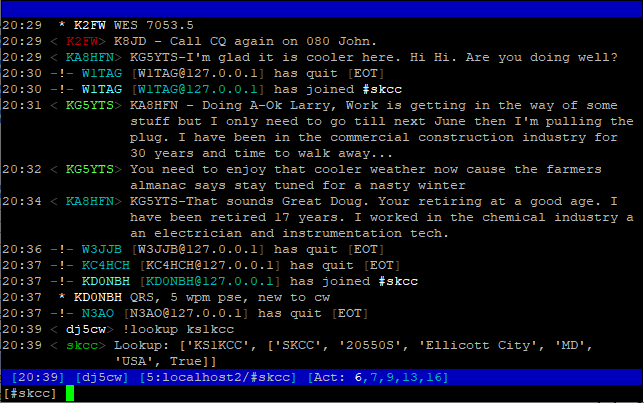

# SKCC Sked Page IRC bridge

This is a Python script which allows you to use the [SKCC Sked page](https://sked.skccgroup.com/) 
with any IRC client.

The SKCC Sked Page is a web based application that allows members of the [Straight Key Century
Club](https://www.skccgroup.com/) to coordinate on-air contacts. Since I always
have an IRC client running anyway (which allows easy access from both PCs and
mobiles), I decided to write a small bridge which translates the messages from
the Sked Page into IRC and vice versa.

## Usage

First create a configuration file called `~/.config/skcc-irc/config.json` that
contains at least the following to configure your callsign and
SKCC Sked Page password.

```
{
  "mycall": "your_callsign",
  "mypw": "your_skcc_sked_password"
}
``` 

Then launch the SKCC IRC bridge and an IRC server with the
launch script `skcc.sh`. It creates a [GNU screen](https://www.gnu.org/software/screen/)
session called "SKCC" with two sub-screens for the two programs.

As soon as you have done this, you can use your favourite IRC client (e.g.
[irssi](https://irssi.org/)) to connect to `irc://localhost:6655/skcc`. Use
your own callsign as your nick name.

Once connected, you'll find all users logged in on the SKCC page, including your own
callsign (prefixed with an underscore, e.g. `_DJ5CW`) plus one user called
`skcc`.

Apart from normal chatting, you can use the following commands (all commands
are prefixed with an exclamation mark):

* `!lookup <call>` - Retrieve SKCC user information for the given callsign

* `!status <text>` - Update your status to <text>

* `!ready` - Reinitialize the chat. This will print the chat history into the channel

* `!back` - If you were absent, this will put you back into the list of active users

* `!away` - Remove yourself from the list of active users

* `!active` - Reset the idle timer for the chat (this is automatically done on any other command, too)

* `!logout` - Log out from the chat (but you can keep reading new messages)

* `!login <password>` - Log in again with the given password

A screenshot (with irssi as the client) is shown below.



## Limitations

Currently the following functions are not implemented yet:

- Deleting your own messages

- Updates of messages sent by other users

- Personal messages


## Requirements

The following is required to run the SKCC IRC bridge.

* Python 3.x

* A running Redis server 

* A running IRC server 

On a freshly installed Ubuntu 22.04 machine, the dependencies can be satisfied like this:

```
sudo apt-get install redis python3-redis python3-websocket python3-pip
python3 -m pip install miniircd
``` 

# Architecture

The script skcc-irc.py launches two main threads:

* `main_ws`: Websocket client that connects to the SKCC chat server
  and translates the messages to a local Redis pub/sub server.

* `main_irc`: Subscribes to the messages on Redis and launches a 
  IRC connection to a local server for every user on the Sked page. Messages
  from the IRC channel are received and sent back to the Websocket via Redis.


